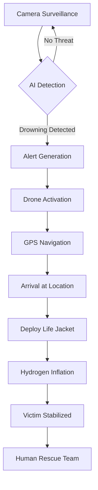

# 🚁 AI-Powered Rescue Drone with Hydrogen-Inflated Life Jacket

[](https://opensource.org/licenses/MIT)
[](https://www.python.org/)
[](https://opencv.org/)
[]()

> An autonomous AI-powered drone system designed to detect drowning individuals and deploy hydrogen-inflated life jackets for immediate rescue support.


---

## 📋 Table of Contents

- [Overview](#overview)
- [Problem Statement](#problem-statement)
- [Proposed Solution](#proposed-solution)
- [Key Features](#key-features)
- [System Architecture](#system-architecture)
- [Technology Stack](#technology-stack)
- [Hardware Components](#hardware-components)
- [Installation](#installation)
- [Usage](#usage)
- [Project Structure](#project-structure)
- [Applications](#applications)
- [Innovation & Uniqueness](#innovation--uniqueness)
- [Market Potential](#market-potential)
- [Roadmap](#roadmap)
- [Contributing](#contributing)
- [License](#license)
- [Contact](#contact)

---

## 🌊 Overview

Drowning is a leading cause of accidental death worldwide, particularly in coastal regions, during floods, and in offshore environments. Traditional rescue methods are often delayed due to human limitations, harsh conditions, or inaccessible areas. This project addresses the urgent need for rapid, intelligent, and automated solutions to prevent these fatalities.

Our **AI-Powered Rescue Drone** combines advanced computer vision, autonomous navigation, and eco-friendly hydrogen technology to create a life-saving system that operates faster and more efficiently than conventional rescue methods.

---

## ⚠️ Problem Statement

Conventional rescue operations face critical challenges:

- ⏱️ **Delayed Response Time** - Traditional methods depend on human rescuers reaching the victim
- 🗺️ **Inaccessibility** - Certain water zones are difficult or impossible for human rescuers to reach quickly
- 👤 **Human Dependency** - Heavy reliance on trained lifeguards and emergency responders
- 📡 **Limited Monitoring** - Lack of real-time surveillance and early detection systems

These limitations contribute to high fatality rates during drowning incidents, making automated solutions essential.

---

## 💡 Proposed Solution

We propose an **autonomous AI-powered drone system** capable of:

1. **Detecting** drowning individuals using advanced computer vision and pattern recognition
2. **Navigating** autonomously to the victim's location using GPS tracking
3. **Deploying** a lightweight, fast-inflating hydrogen-powered life jacket
4. **Providing** immediate flotation support while human rescuers arrive

---

## ✨ Key Features

### 🤖 AI-Powered Detection
- Real-time drowning detection using computer vision algorithms
- Pattern recognition for identifying distress behaviors
- Multiple camera feed support for wide-area coverage

### 🛸 Autonomous Navigation
- GPS-based autonomous flight to victim location
- Obstacle avoidance and path planning
- Return-to-base functionality

### 🎈 Hydrogen Inflation System
- Lightweight, fast-inflating life jackets
- Eco-friendly hydrogen generation
- Safe deployment mechanism

### 📊 Real-Time Monitoring
- Live video feed transmission
- Alert system integration
- Emergency response coordination

---

## 🏗️ System Architecture

```
┌─────────────────────────────────────────────────────────────┐
│                     CONTROL CENTER                          │
│  ┌──────────────┐  ┌──────────────┐  ┌──────────────┐    │
│  │  Monitoring  │  │     Alert    │  │  Emergency   │    │
│  │   Dashboard  │  │    System    │  │  Response    │    │
│  └──────────────┘  └──────────────┘  └──────────────┘    │
└─────────────────────────────────────────────────────────────┘
                            │
                            │ 4G/5G Connection
                            ▼
┌─────────────────────────────────────────────────────────────┐
│                      RESCUE DRONE                           │
│  ┌──────────────┐  ┌──────────────┐  ┌──────────────┐    │
│  │   AI Vision  │  │  Navigation  │  │  Deployment  │    │
│  │    Module    │──│    System    │──│   Mechanism  │    │
│  └──────────────┘  └──────────────┘  └──────────────┘    │
│         │                  │                  │            │
│         ▼                  ▼                  ▼            │
│  ┌──────────────┐  ┌──────────────┐  ┌──────────────┐    │
│  │   Cameras    │  │  GPS/IMU     │  │  H2 Jacket   │    │
│  └──────────────┘  └──────────────┘  └──────────────┘    │
└─────────────────────────────────────────────────────────────┘
                            │
                            ▼
                    ┌───────────────┐
                    │   VICTIM      │
                    │   LOCATION    │
                    └───────────────┘
```

### System Flow



---

## 🔧 Technology Stack

### Software

| Component | Technology |
|-----------|------------|
| **AI/ML Framework** | TensorFlow, PyTorch, OpenCV |
| **Programming Language** | Python 3.8+ |
| **Computer Vision** | YOLO, CNN-based detection models |
| **Flight Control** | DroneKit, MAVLink, PX4 |
| **Communication** | 4G/5G modules, RF telemetry |
| **Backend** | Flask/FastAPI for API |
| **Database** | MongoDB/PostgreSQL |
| **Cloud Services** | AWS/Azure for data processing |

### Hardware

| Component | Specification |
|-----------|---------------|
| **Drone Platform** | Quadcopter/Hexacopter frame |
| **Flight Controller** | Pixhawk/ArduPilot |
| **Camera** | 4K action camera, thermal imaging |
| **GPS Module** | High-precision GPS |
| **Onboard Computer** | Raspberry Pi 4 / NVIDIA Jetson Nano |
| **Hydrogen System** | Portable H2 generator + storage |
| **Life Jacket** | Inflatable vest with H2 cartridge |
| **Battery** | LiPo 6S, 10000mAh+ |

---

## 🛠️ Hardware Components

### Drone Platform
- **Frame**: Carbon fiber quadcopter/hexacopter
- **Motors**: Brushless DC motors (1000-1500 KV)
- **ESCs**: 30-40A electronic speed controllers
- **Propellers**: 10-12 inch carbon fiber props

### AI Processing Unit
- **Option 1**: NVIDIA Jetson Nano (GPU acceleration)
- **Option 2**: Raspberry Pi 4 (8GB RAM) + Google Coral TPU

### Sensing Systems
- **Primary Camera**: 4K camera for drowning detection
- **Thermal Camera**: FLIR module for low-light conditions
- **GPS**: u-blox NEO-M8N
- **IMU**: 9-axis motion tracking

### Deployment Mechanism
- **Servo Motors**: High-torque servos for release mechanism
- **Life Jacket**: Lightweight inflatable vest (< 500g)
- **Hydrogen System**: Micro fuel cell or cartridge-based

---

## 📥 Installation

### Prerequisites

```bash
# System requirements
- Python 3.8 or higher
- CUDA toolkit (for GPU acceleration)
- OpenCV 4.x
- DroneKit library
```

### Setup Instructions

1. **Clone the repository**

```bash
git clone https://github.com/Ranjithkumarveesam/AI-Rescue-Drone.git
cd AI-Rescue-Drone
```

2. **Create virtual environment**

```bash
python -m venv venv
source venv/bin/activate  # On Windows: venv\Scripts\activate
```

3. **Install dependencies**

```bash
pip install -r requirements.txt
```

4. **Configure settings**

```bash
cp config/config.example.yaml config/config.yaml
# Edit config.yaml with your specific settings
```

5. **Download AI models**

```bash
python scripts/download_models.py
```

---

## 🚀 Usage

### Running the System

#### 1. Start the Detection Module

```bash
python src/detection/drowning_detector.py --source camera --config config/config.yaml
```

#### 2. Launch Drone Control

```bash
python src/drone/flight_controller.py --connect /dev/ttyUSB0 --baud 57600
```

#### 3. Start Monitoring Dashboard

```bash
python src/dashboard/monitor.py --port 8000
```

Access dashboard at: `http://localhost:8000`

### Simulation Mode

For testing without hardware:

```bash
python src/simulation/sim_runner.py --scenario beach_rescue
```

---

## 📁 Project Structure

```
AI-Rescue-Drone/
│
├── src/
│   ├── detection/              # AI drowning detection module
│   │   ├── drowning_detector.py
│   │   ├── models/
│   │   └── utils/
│   │
│   ├── drone/                  # Drone control and navigation
│   │   ├── flight_controller.py
│   │   ├── navigation.py
│   │   └── telemetry.py
│   │
│   ├── deployment/             # Life jacket deployment system
│   │   ├── release_mechanism.py
│   │   └── hydrogen_control.py
│   │
│   ├── communication/          # Data transmission
│   │   ├── telemetry_sender.py
│   │   └── alert_system.py
│   │
│   └── dashboard/              # Monitoring interface
│       ├── monitor.py
│       └── templates/
│
├── config/                     # Configuration files
│   ├── config.yaml
│   └── drone_params.yaml
│
├── models/                     # Trained AI models
│   ├── drowning_detection_v1.h5
│   └── yolov8_custom.pt
│
├── scripts/                    # Utility scripts
│   ├── download_models.py
│   ├── calibrate_camera.py
│   └── test_hardware.py
│
├── tests/                      # Unit and integration tests
│   ├── test_detection.py
│   ├── test_navigation.py
│   └── test_deployment.py
│
├── docs/                       # Documentation
│   ├── architecture.md
│   ├── hardware_setup.md
│   ├── api_reference.md
│   └── images/
│
├── simulation/                 # Simulation environments
│   ├── gazebo_world/
│   └── test_scenarios/
│
├── requirements.txt            # Python dependencies
├── Dockerfile                  # Container configuration
├── .gitignore
├── LICENSE
└── README.md
```

---

## 🎯 Applications

This rescue drone system has wide-ranging applications across multiple sectors:

### Public Safety
- 🏖️ **Beach and Coastal Surveillance** - Real-time monitoring of swimming areas
- 🌊 **Flood and Disaster Rescue** - Emergency response in natural disasters
- 🚢 **Offshore Industries** - Marine transport and oil platform safety

### Commercial
- 🏊 **Water Parks and Resorts** - Enhanced safety for tourists and guests
- 🛥️ **Cruise Ships** - Overboard detection and response
- 🎣 **Fishing Industry** - Safety for fishing vessels and crews

### Government & Defense
- 🛡️ **Coast Guard Operations** - Enhanced maritime rescue capabilities
- 🏛️ **National Defense** - Border security and surveillance
- 🚨 **Emergency Services** - Municipal water safety programs

---

## 🌟 Innovation & Uniqueness

This project stands out through its integration of cutting-edge technologies:

1. **Multi-Technology Integration**
   - Combines AI, autonomous drones, and hydrogen technology in a unified rescue system
   - First-of-its-kind integration of clean energy with emergency response

2. **Autonomous Operation**
   - Real-time automated life-saving intervention without direct human involvement
   - Faster response than traditional lifeguard methods

3. **Eco-Friendly Design**
   - Uses hydrogen instead of CO2 for inflation
   - Promotes sustainable emergency response technology

4. **Scalability**
   - Can be deployed across various water environments
   - Adaptable to different geographical and climatic conditions

---

## 📈 Market Potential

The global drowning prevention and water safety market presents significant opportunities:

### Market Drivers
- **Growing Drone Market**: Expected CAGR of 15%+ in commercial drone sector
- **AI Adoption**: Increasing integration of AI in safety systems
- **Hydrogen Economy**: Rising investment in hydrogen technologies
- **Public Safety Awareness**: Heightened focus on water safety globally

### Target Markets
1. **Domestic**: Indian coastal states, flood-prone regions
2. **International**: Southeast Asia, Middle East, European coastal nations
3. **Sectors**: Tourism, maritime transport, defense, emergency services

### Competitive Advantages
- Lower operational costs compared to human-staffed rescue teams
- 24/7 autonomous operation capability
- Rapid deployment and response time
- Scalable across multiple locations

---

## 🗺️ Roadmap

### Phase 1: Development (Current)
- [x] Concept and design finalization
- [x] Component selection and procurement
- [ ] AI model training for drowning detection
- [ ] Prototype drone assembly
- [ ] Hydrogen inflation system integration

### Phase 2: Testing (Q2 2026)
- [ ] Laboratory testing of individual modules
- [ ] Simulation environment testing
- [ ] Field testing in controlled environments
- [ ] Safety certification and compliance

### Phase 3: Pilot Deployment (Q3 2026)
- [ ] Beach resort pilot program
- [ ] Data collection and analysis
- [ ] System optimization based on feedback
- [ ] Emergency response team training

### Phase 4: Commercial Launch (Q4 2026)
- [ ] Full-scale production
- [ ] Marketing and partnerships
- [ ] Government approvals and certifications
- [ ] International market expansion

---

## 🤝 Contributing

We welcome contributions from the community! Here's how you can help:

### Ways to Contribute

1. **Code Contributions**
   - Improve detection algorithms
   - Enhance navigation systems
   - Optimize deployment mechanisms

2. **Documentation**
   - Improve README and guides
   - Add tutorials and examples
   - Translate documentation

3. **Testing**
   - Report bugs and issues
   - Suggest new features
   - Test in different environments

### Contribution Process

1. Fork the repository
2. Create a feature branch (`git checkout -b feature/AmazingFeature`)
3. Commit your changes (`git commit -m 'Add some AmazingFeature'`)
4. Push to the branch (`git push origin feature/AmazingFeature`)
5. Open a Pull Request

Please read [CONTRIBUTING.md](CONTRIBUTING.md) for details on our code of conduct and development process.

---

## 📄 License

This project is licensed under the MIT License - see the [LICENSE](LICENSE) file for details.

---

## 👤 Contact

**Ranjith Kumar Veesam**

- 🌐 GitHub: [@Ranjithkumarveesam](https://github.com/Ranjithkumarveesam)
- 📧 Email: ranjithvessam111@gmail.com
- 📍 Location: Anakapalle, India
- 💼 LinkedIn: [Connect with me](https://linkedin.com/in/ranjithkumarveesam)

**Project Link**: [https://github.com/Ranjithkumarveesam/AI-Rescue-Drone](https://github.com/Ranjithkumarveesam/AI-Rescue-Drone)

---

## 🙏 Acknowledgments

- OpenCV community for computer vision tools
- DroneKit developers for flight control libraries
- Research papers on drowning detection algorithms
- Open-source drone and AI communities

---

## 📊 Project Statistics


---

<div align="center">

**⭐ Star this repository if you find it helpful!**

Made with ❤️ for saving lives

</div>